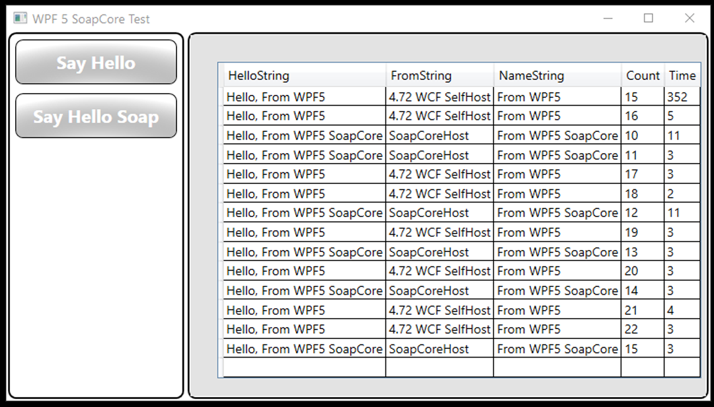
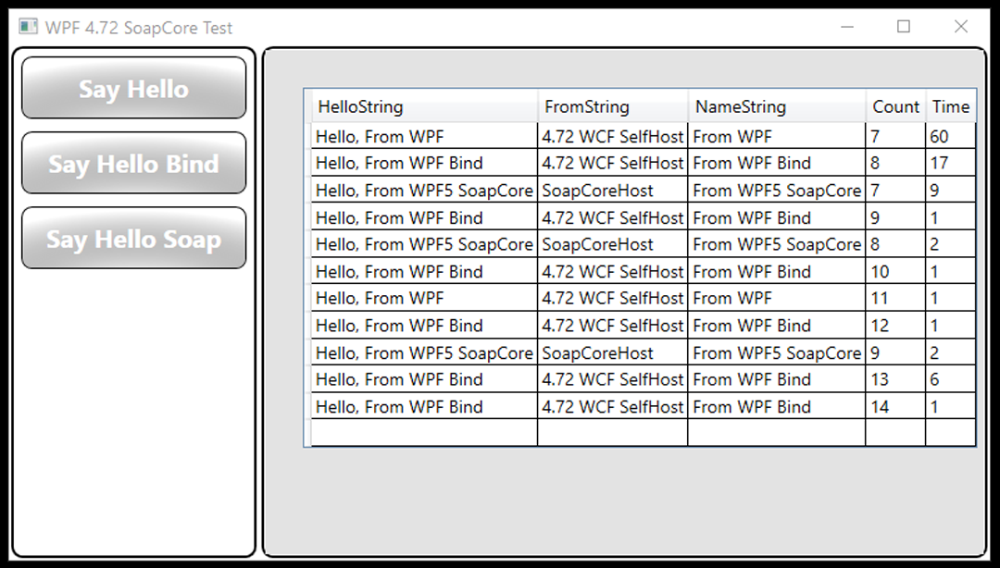
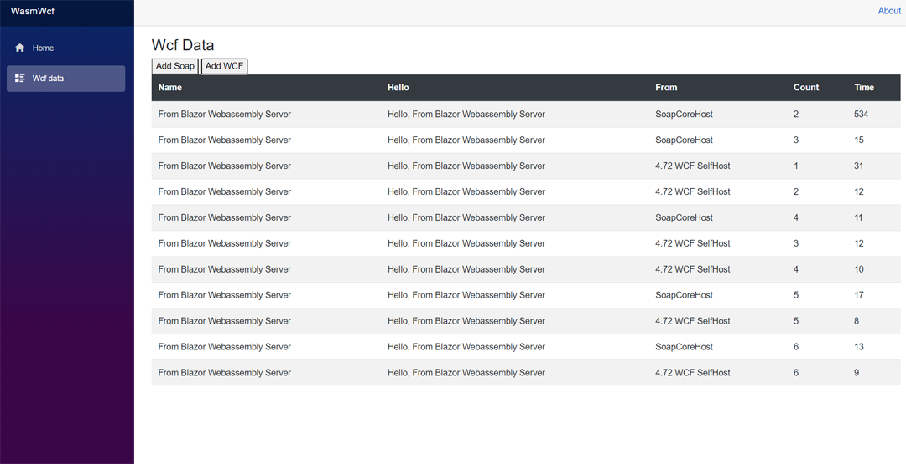
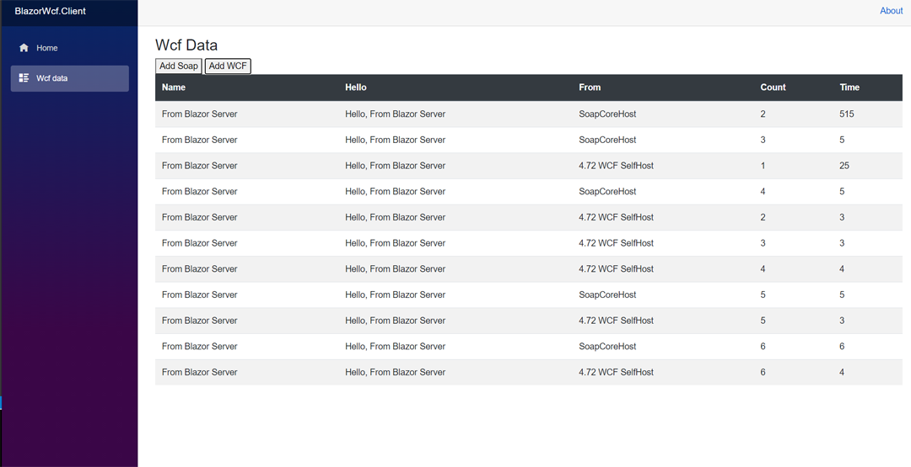
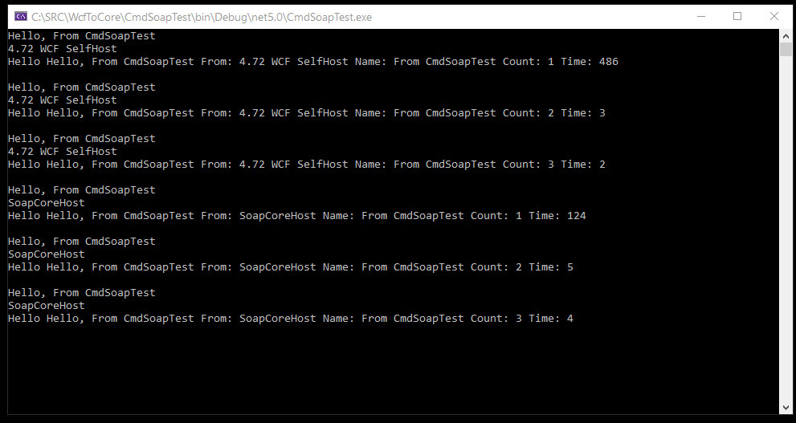
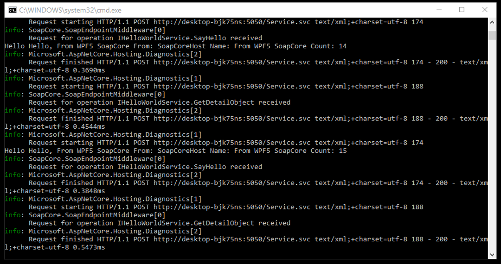

By Stewart Hyde
===============

Introduction
============

I design this GitHub project as an experiement to see what it takes to call WCF
services in .Net 5 projects. The basically idea is provide an upgrade path from
.Net Framework and still keep the same code.

Client side uses .Net 5 ServiceModel useing web address for the service.
Server-side modifications uses SoapCore NuGet package and alot of inspiration
for this code was found on SoapCore GitHub page and especially examples.

[GitHub - DigDes/SoapCore: SOAP extension for ASP.NET
Core](https://github.com/DigDes/SoapCore)

I took the following steps: 1. Created .Net Framework 4.72 project with WPF
client and WPF Self Host. 2. Created .Net 5 WPF base on 4.72 project and use
technique shown in examples 3. Once I got above working, I created SoapCore Host
and made modifications for services 4. I decidied to try this on Microsoft
Blazor 1. Blazor Webassembly Hosted was first attempt and it work fine 2. Blazor
Webasembly - had trouble and needs more research but believe it related to Wasm
not support ServiceModel 3. Blazor Server was also created 5. Also included is
command line test application

One special note, I was able to get both WCF Hosted and SoapCore Hosted to work
at same service on clients, but the names of service must be same name.

The following is example screen from WPF 5 application running test.

The Following is example screen from WPF Framework application running test

The Following is example screen from Blazor Webassembly Hosted running test

The following is example screen from Blazor Server running test

The following is the command line test application.

The following output is from SoapCore host application.

